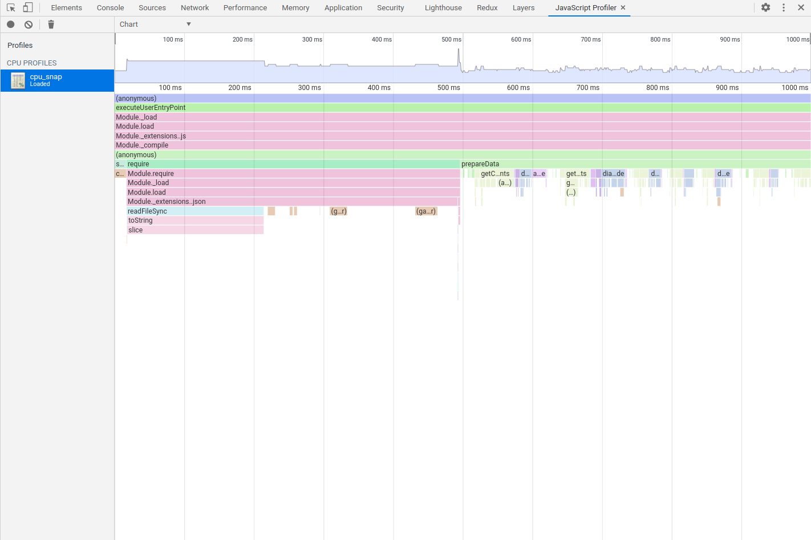
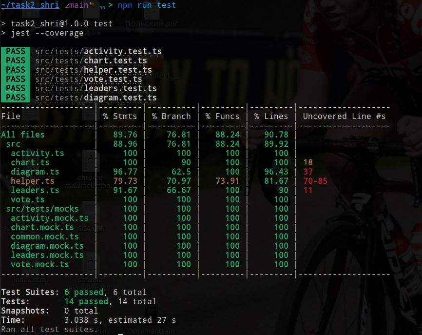

# Задание 2. Подготовьте данные для Stories
### Инструменты
В качестве инструмента разработки был выбран TypeScript, так как уже были написаны типы, оставалось только ими воспользоваться.
Был неприятно удивлён, когда первая версия решения прошла ваши автотесты. К тому моменту своих тестов я ещё не написал, соответственно возможности проверить корректность алгоритма после внесения изменений у меня больше не было.  
В качестве фреймворка для автотестов был использован ts-jest
### Perfomance
Похвастаться хорошей архитектурой я не могу, но я немного поэкспериментировал с производительностью и вот что из этого вышло:  
Заменив проверку наличия элемента в массиве объектом, в функциях ```getComments``` и ```getSummaries``` я добился ускорения исполнения этих функций с 3500ms до 52ms и с 296ms до 56,4ms соответственно.
Так же создав объект ```dateTimeFormat``` ускорил работу функции ```activitySlide``` с 85ms до 22.7ms (до этого форматирования происходило в цикле)


В итоге, исполнение скрипта, который обрабатывает все спринты в файле ```input.json``` длится 1.93s total time. P.S. по крайней мере в той версии, которую я отправлял на автотесты :)
### Тесты
В ходе написания тестов были выявлены недочёты в коде и алгоритме, что позволило в очередной раз убедиться в необходимости их написания и исправить найденные ошибки. Тесты покрывают 95% кода.

### Заключение
Надеюсь что я не пропустил edje кейсы, но меня очень настораживает то, что мой код прошёл Ваши тесты с первого раза.  
Было бы очень полезно иметь возможность повторно пройти автотесты перед отправкой на ручную проверку, даже если какая-то версия прошла их.
## UPD 27.03.2021
Появилось время и решил написать ещё тестов и порефакторить код и нашёл кучу ошибок, которые, по идее, не должны были дать возможность пройти хоть сколько-нибудь серьёзные тесты.  
Надеюсь, что нашёл и исправил большинство ошибок. Время исполнения увеличилось незначительно.  
После переписки с разработчиками задания, была добавлена и частично протестирована обработка сущностей, вложенных в другие сущности.

  
------  
Связь со мной  
https://t.me/llabloko  
mineralsfree@gmail.com  
